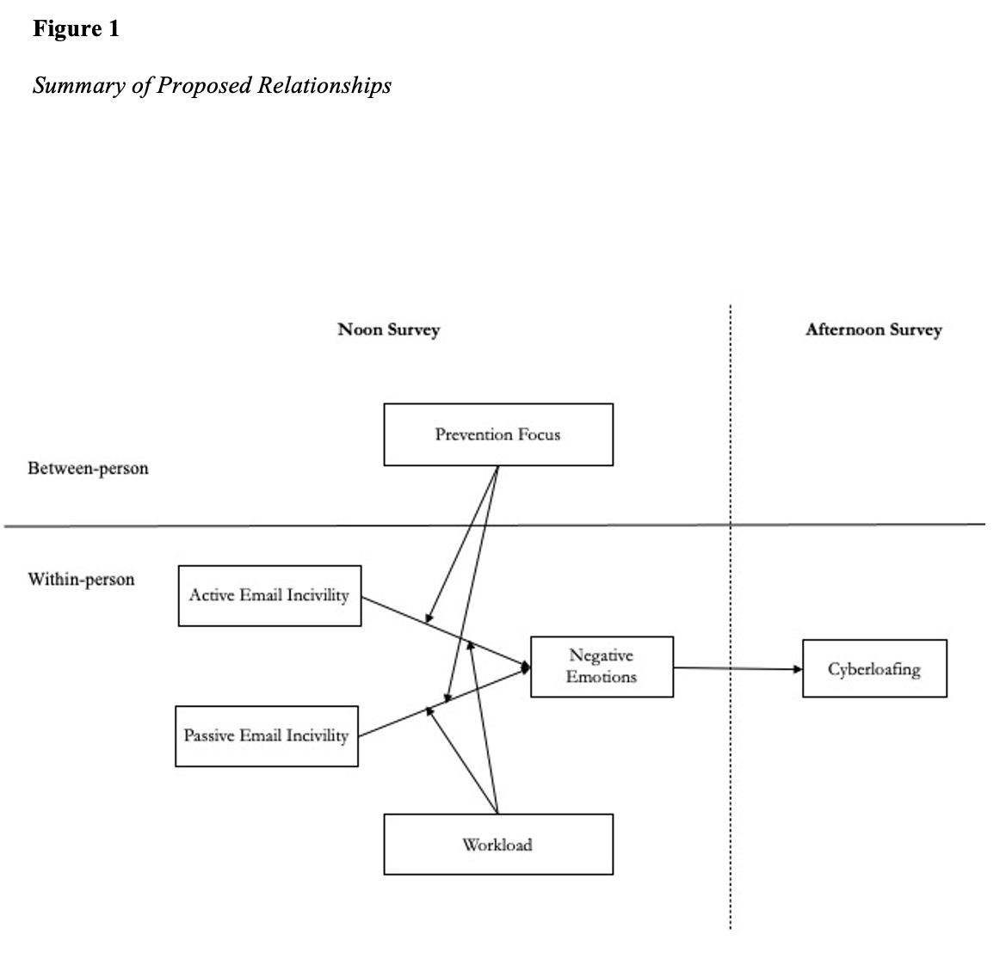
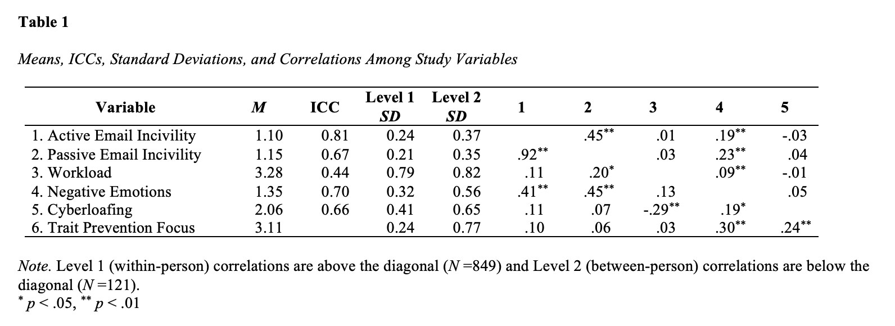
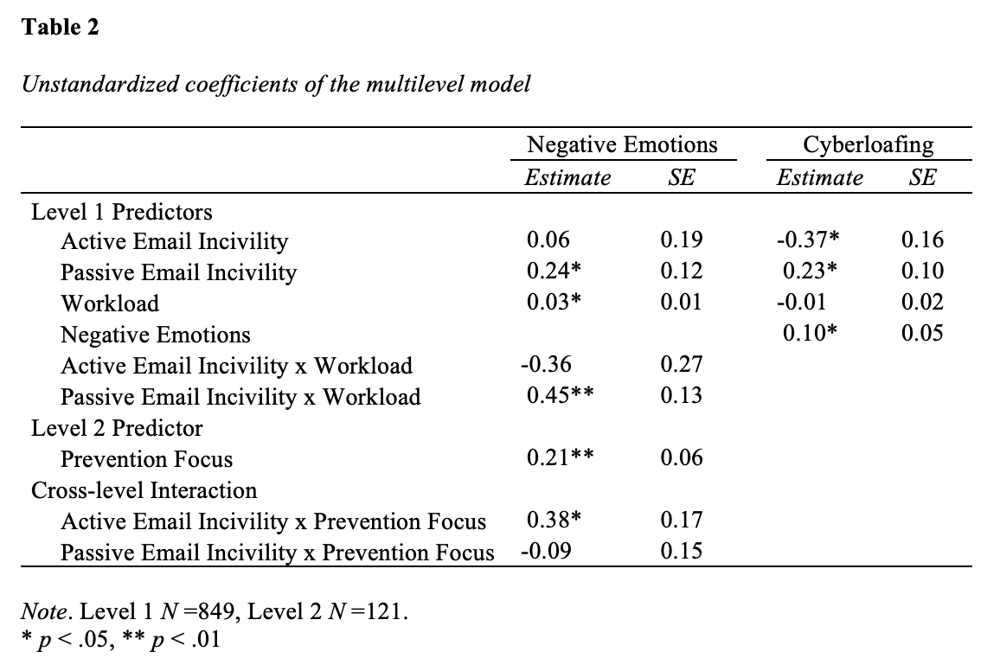
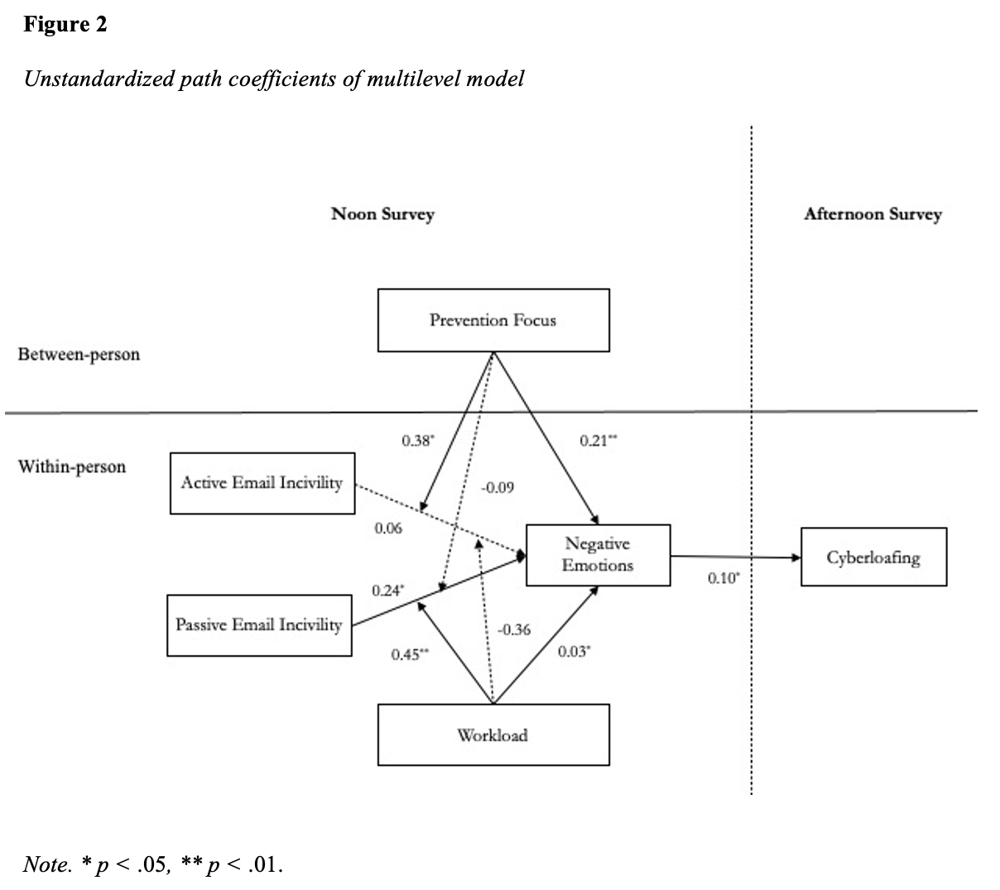
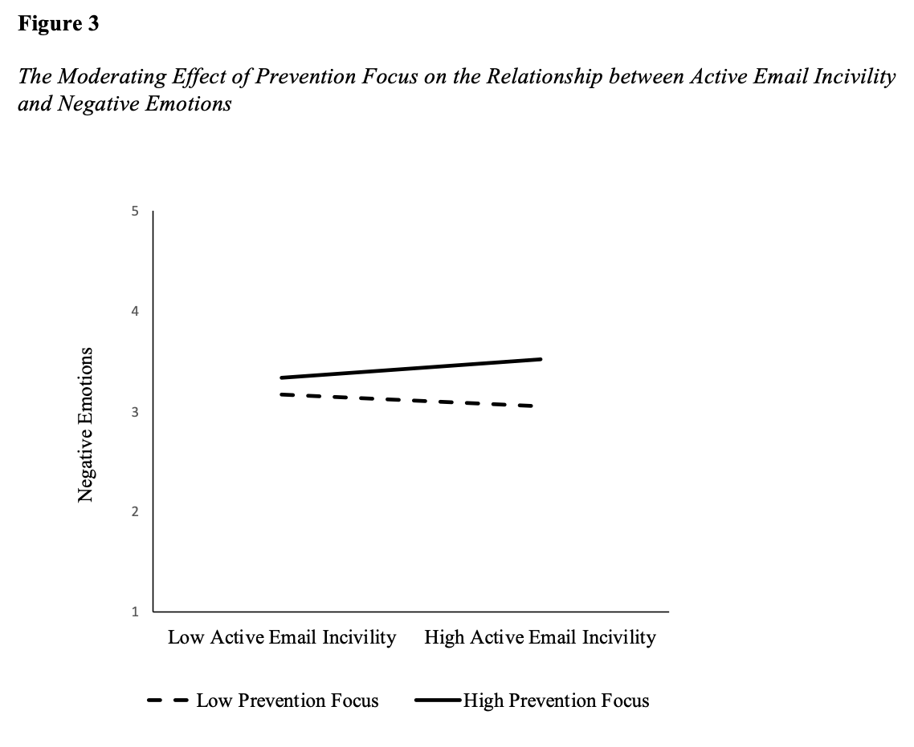
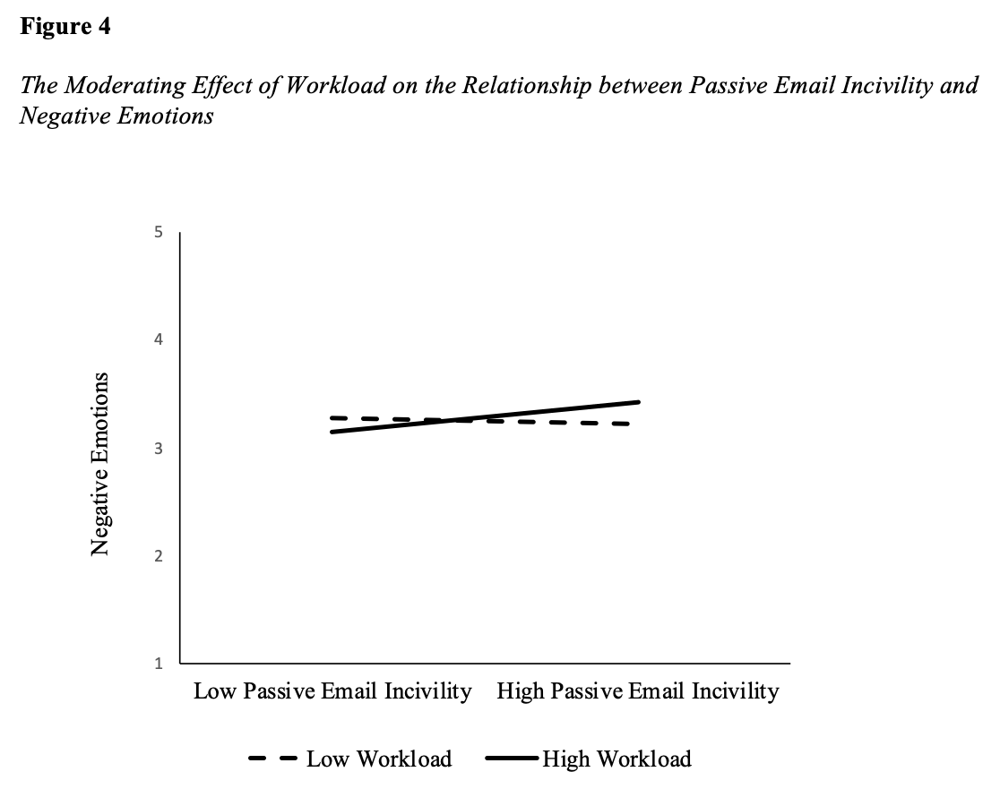

```{r setup, include=FALSE}
knitr::opts_chunk$set(echo = FALSE)

# Learn more about creating blogs with Distill at:
# https://rstudio.github.io/distill/blog.html

```


Information communication technologies (ICTs) have become a large part of employees’ work life (Schlachter et al., 2018). ICTs are a possible medium for negative experiences at work, such as increased email incivility, defined as email behaviors that violate workplace norms of mutual respect (Lim & Teo, 2009). Initial findings suggest that experiencing email incivility can negatively affect job attitudes (Lim & Teo, 2009) and job performance (Giumetti et al., 2016), and positively predict employee distress at work and at home (Park et al., 2018), work withdrawal (Park & Haun, 2018), and insomnia (Yuan et al., 2020). 

The prevalence of ICTs also provides opportunities for employees to engage in more cyberloafing, defined as the use of ICTs for nonwork-related purposes during work hours (Mercado et al., 2017). Employees might engage in cyberloafing for various reasons, negative work-related experiences being among them (Mercado et al., 2017). Given that email incivility is a negative work-related experience that shares the ICTs medium with cyberloafing, it is likely that email incivility experience can also trigger employees’ cyberloafing. In the current study, we examine whether daily experiences of email incivility positively predict employees’ engagement in cyberloafing, whether this relationship is mediated by negative emotions, and whether pertinent individual and situational factors might exacerbate this mediated relationship. 

These efforts extend the literature in the following ways. First, the current study contributes to a broader understanding of how email incivility might lead to increased negative employee behaviors at work. Second, based on affective events theory (AET; Weiss & Cropanzano, 1996), we propose that negative emotions will mediate the relationship between daily email incivility and cyberloafing. Third, the current study extends the limited knowledge of potential individual and situational boundary conditions for the negative effects of email incivility by examining trait prevention focus and daily workload as moderators. Lastly, Yuan et al. (2020) established that email incivility can be differentiated into active and passive types. The current study joins this effort to examine whether active and passive email incivility will show differential relationships with negative emotions and subsequent cyberloafing. 

## Theoretical Framework and Hypotheses Development

***Affective Events Theory***

The current study draws on Weiss and Cropanzano's (1996) affective events theory (AET) as the main theoretical framework. AET argues that emotions vary over time within individuals (Weiss, 2002) and that work-related events are antecedents of emotions (Cropanzano et al., 2017). Further, within-person fluctuations of emotions can contribute to changes in behaviors (Weiss & Beal, 2005). AET highlights the moderating role of dispositions and situational factors on the relationship between work events and affective reactions. 

***Email Incivility and Negative Emotions***

Email incivility refers to “communicative behavior exhibited in computer-mediated interactions that violate workplace norms of mutual respect” (Lim & Teo, 2009, p. 419). Email incivility has an established two-dimensional structure including both active email incivility and passive email incivility (Lim & Teo, 2009; Yuan et al., 2020).

In the current study, we propose that active and passive email incivility will positively predict negative emotions. Specifically, the experience of active email incivility, such as being the target of a discourteous email, can convey a sense of disrespect to the targets who will likely generate negative feelings about it (Yuan et al., 2020). Meanwhile, passive email incivility can be appraised to have more ambiguity than active email incivility (Yuan et al., 2020). This ambiguity appraisal is likely to make the targets ruminate more about passive email incivility experience and elicit increased negative emotions (Wang et al., 2013).

- *Hypothesis 1*: Daily morning active (1a) and passive (1b) email incivility will be positively related to midday negative emotions.

***Negative Emotions and Cyberloafing***

Cyberloafing involves using ICTs for nonwork purposes during work time such as playing computer games (Mercado et al., 2017). Based on AET (Weiss & Cropanzano, 1996), negative affective reactions can lead to increased affect-driven behaviors. This is consistent with the stressor-emotion model of CWBs (Spector & Fox, 2005) arguing that experiencing workplace stressors can elicit negative emotions that drive employee deviant behaviors. Specifically, employees will perceive negative emotions as a threat to their goals and will be more likely to engage in deviant behaviors to reduce these feelings (Fox et al., 2001; Lazarus, 1991). 

- *Hypothesis 2*: Daily midday negative emotions will be positively related to afternoon cyberloafing. 

***Email Incivility, Negative Emotions, and Cyberloafing***

According to AET (Weiss & Cropanzano, 1996) and the stressor-emotion model of CWB (Spector & Fox, 2005), negative affective reactions will mediate the relationship between daily workplace stressor experience and employee deviant behaviors. Empirical research provides support for this notion, such that daily negative emotions mediate the relationships of negative work events (Matta et al., 2014) and illegitimate tasks (Zhou et al., 2018) with CWBs. 

- *Hypothesis 3*: Daily midday negative emotions will mediate the relationships between daily morning active (3a) and passive (3b) email incivility and afternoon cyberloafing.

***Trait Prevention Focus as a Moderator***

Individuals with higher prevention focus are more sensitive to inappropriate treatment during interpersonal relationships (Keller et al., 2008; Zhang et al., 2011). Given that email incivility is an interpersonal mistreatment (Lim & Teo, 2009), it is likely that individuals of higher prevention focus have stronger emotional reactions. Passive email incivility can interrupt employees’ work pace and has the potential to lead to worse performance. When experiencing email incivility that is perceived as mistreatment or threatens one’s ability to maintain performance goals, employees with higher trait prevention focus are likely to have stronger negative affective reactions to them.  

- *Hypothesis 4*: Trait prevention focus will moderate the relationships between daily morning active (4a) and passive (4b) email incivility and midday negative emotions, such that the positive relationships are stronger for those with higher prevention focus than for those with lower prevention focus.

***Daily Workload as a Moderator***

Situational factors can also affect employees’ affective reactions to work-related events (Weiss & Beal, 2005; Weiss & Cropanzano, 1996). Workload can deplete employees’ resources (Zohar et al., 2003) and on days when employees have a higher level of workload, they will have fewer cognitive resources to cope with email incivility. They are more likely to find email incivility goal-disrupting, which can elicit stronger negative affective reactions (Zohar et al., 2003). 
Hypothesis 5: Daily workload will moderate the relationships between daily morning active (4a) and passive (4b) email incivility and midday negative emotions, such that the positive relationships are stronger on days with higher levels of workload than on days with lower levels of workload. 



## Method

We recruited our participants from Academic Prolific. Qualified participants, had to be: 18 years and older, fluent in English, working full-time, working a 9-5 shift, residing in the US, having an approval rate of 90% or above in previous studies on Academic Prolific, and having frequent interactions with other people at work. During the following two weeks, participants were asked to complete two daily surveys every workday: between 1-3pm for the midday survey and between 4-6pm for the afternoon survey. 

A total of 147 qualified participants were enrolled for the daily data collection, and 121 participants provided valid data to be included in our analyses. Among them, 71.7% were male, and 81% were white. Their average age was 33.63 years old (SD= 7.58), their average tenure was 5.92 years (SD= 5.57), and they worked on average 41.55 hours per week (SD= 4.22). 

We measured demographic variables and trait prevention focus in the baseline survey, email incivility experience, workload, and negative emotions in the midday survey, and cyberloafing in the afternoon survey.

- *Trait prevention focus*. Measured with 9 items from Lockwood et al. (2002). Participants were asked to indicate the extent to which the items described them in general on a scale from 1 (Strongly disagree) to 5 (Strongly agree). An example item was “In general, I am focused on preventing negative events in my life” (alpha = .88).

- *Email incivility*. Measured active (7 items) and passive (7 items) email incivility using the scale from Lim and Teo (2009), for which a two-dimension structure was established (Yuan et al., 2020). Participants were asked how many times they have experienced each of the 14 events in the morning from coworkers from their workgroup, and response options ranged from 1 (Never) to 6 (Five times or more). An example item for active incivility was “Made demeaning or derogatory remarks about you through email” and an example item for passive incivility was “Replied to your emails but did not answer your queries”. The average Cronbach’s alpha across days was .95 (SD = .02) for active email incivility and .91 (SD = .03) for passive email incivility. 

- *Workload*. Measured with two items from Rodell and Judge (2009). Participants were asked to indicate the extent to which they agreed with the items on a scale from 1 (Strongly Disagree) to 5 (Strongly Agree). An example item was “This morning, I've had a lot work to do”. The average Cronbach’s alpha across days was .91 (SD = .03). 

- *Negative emotions*. Measured with 5 items from Watson et al. (1988). Participants were asked to indicate the extent to which they felt each of the emotions at that time on a scale from 1 (Very slightly or not at all) to 5 (Extremely). Example emotions included “mad”, “afraid”, and “sad”.  The average Cronbach’s alpha across days was .85 (SD = .04).

- *Cyberloafing*. Measured with a 4-item scale adapted from Lim (2002). Participants were asked how often they engaged in the presented activities during the afternoon’s working hour on a scale from 1 (Never) to 5 (Often). An example items was “Browsing nonwork-related websites on your computer or cellphone.” The average Cronbach’s alpha across days was .77 (SD = .05).

- *Control variable*. We controlled for whether the participants were working from home or in the office on each day . 

***Analytic Strategy***

Because our data has daily (level 1) measurements of email incivility, workload, negative emotions, and cyberloafing nested within individuals (level 2) with one level 2 variable, we used multilevel modeling to test our hypotheses with Mplus 8.3 (Muthén & Muthén, 2010). We tested a two-level model specifying level 1 main effects (H1 & H2), level 1 interaction (H4), and cross-level interaction (H5). We tested the mediation hypothesis (H3) by estimating the confidence intervals (CIs) for indirect effects of active email incivility and passive email incivility with 20,000 Monte Carlo replications (Preacher et al., 2010). We used 90% CI to improve the statistical power in multilevel modeling mediation analysis (Taylor et al., 2019; Zhou et al., 2017). We followed recommendations from Enders and Tofighi (2007) to group-mean center level 1 predictors (active email incivility, passive email incivility, and workload) and grand-mean center level 2 predictor (trait prevention focus). In all models, we specified random slope effects for level 1 relationships proposed in hypotheses. 

## Results
Table 1 shows the intraclass correlation coefficients (ICCs), means, standard deviations, and correlations among study variables at level 1 and level 2. The ICC for cyberloafing was .66, suggesting that 34% of the variance of daily cyberloafing was within individuals across 10 days; the ICC for negative emotions was .70, suggesting that 30% of the variance of daily negative emotions was within individuals across 10 days.



***Multilevel Confirmatory Factor Analysis***

We conducted multilevel confirmatory factor analyses on the five daily measures. We used 3-item parcels as indicators (Little et al., 2002) for three of our measures (active email incivility, passive email incivility, and negative emotions) while keeping the original items for workload and cyberloafing. The 5-factor model fitted our data well (*chi-square difference* (160) = 261.99, p < .01, CFI = 0.97, TLI = 0.95, RMSEA = 0.03), and was significantly better than a 4-factor model where all email incivility items were combined *chi-square difference* (8) = 41.22, p < .001 or a 1-factor with *chi-square difference* (20) = 1405, p < .001, providing evidence for the distinction among the within-person daily constructs. 

***Hypothesis Testing***

Table 2 and Figure 2 show unstandardized regression coefficients for our two-level model. While passive email incivility significantly predicted negative emotions (*gamma* = 0.24, SE= 0.12, p < .05), active email incivility did not have a significant main effect on negative emotions (*gamma* = 0.06, SE= 0.19, p = .75). Hypothesis 1b was supported while Hypothesis 1a was not. Negative emotions significantly predicted cyberloafing (*gamma* = 0.10, SE= 0.05, p < .05), supporting Hypothesis 2. The indirect effect of active email incivility on cyberloafing via negative emotions was not significant (indirect effect= 0.006, 90% CI [-0.027, 0.044]) while the indirect effect of passive email incivility on cyberloafing via negative emotions was significant (indirect effect= 0.024, 90% CI [0.001, 0.055]). Hypothesis 3b was supported while Hypothesis 3a was not.




Table 2 and Figure 2 also show the moderation effects. Trait prevention focus significantly moderated the effect of active email incivility on negative emotions (*gamma* = 0.38, SE= 0.17, p < .05), but did not significantly moderate the effect of passive email incivility on negative emotions (*gamma* = -0.09, SE= 0.15, p = .54). Simple slope analyses suggest that the effect of active email incivility on negative emotions was significant and positive for those with high trait prevention focus (slope = 0.36, p < .05), but not significant for those with low trait prevention focus (slope = -0.23, p = .40). Figure 3 shows this pattern. Hypothesis 4a was supported while Hypothesis 4b was not supported.



Workload significantly moderated the effect of passive email incivility on negative emotions (*gamma* = 0.45, SE= 0.13, p < .01), but did not significantly moderate the effect of active email incivility on negative emotions (*gamma* = -0.36, SE= 0.27, p = .13). Simple slope analyses suggest that the effect of passive email incivility on negative emotions was significant and positive when workload was high (slope = 0.41, p < .05), but not significant when workload was low (slope = -0.29, p = .24). Figure 4 shows this pattern. Hypothesis 5b was supported while Hypothesis 5a was not supported.



## Discussion

We examined the effects of daily morning active and passive email incivility on employees’ afternoon cyberloafing via midday negative emotions and explored dispositional and situational moderators. Findings suggest that morning passive email incivility, but not active email incivility, had a positive main effect on midday negative emotions and subsequent afternoon cyberloafing. Moderation analyses suggest that active email incivility had a positive effect for those with higher trait prevention focus and that passive email incivility had a stronger effect on days employees experience higher workload. 

***Research Implications***

Our findings extend our understanding of the impact of workplace incivility on employee deviant behaviors virtually. Given that ICTs can be a potential medium for mistreatment experiences (Lim & Teo, 2009) and deviant behaviors ( Mercado et al., 2017), we demonstrate that email incivility not only affects employees’ well-being outcomes (Park et al., 2018), but can also trigger increased ICTs-related deviant behaviors such as cyberloafing. 

Our findings suggests that negative emotions link passive email incivility with cyberloafing. We found that daily experiences of email incivility, is positively related to employees’ negative affective reactions. Further, we demonstrate that employees are more likely to engage in cyberloafing in the afternoon on days they experience stronger negative emotions at midday. Only the positive effect of passive email incivility on negative emotions was significant, while the effect of active email incivility was not. This further confirms the importance of distinguishing between active and passive email incivility (Yuan et al., 2020). 

Finally, our findings on the moderating effects of dispositional and situational factors contribute to the understanding of boundary conditions for the effects of email incivility. Active email incivility had a positive effect on negative emotions only for individuals with higher trait prevention focus, but not for those with lower trait prevention focus. This is consistent with the notion that individuals with higher trait prevention focus are more sensitive to the experiences of negative situations and hence have stronger negative reactions (Higgins, 1997).

We found that daily workload strengthens the positive effect of passive email incivility on negative emotions. This confirms the notion that situational factors can affect the relationship between work-related events and affective reactions (Weiss & Beal, 2005; Weiss & Cropanzano, 1996).

***Limitations and Directions for Future Research***

Our study has limitations that we encourage future research to address. First, while we separated our measures across the baseline survey, daily midday survey, and daily afternoon survey to reduce common method variance (Podsakoff et al., 2003), some concern remains since we only collected self-reported data. Future research can explore more objective measures. Researchers could use third parties’ coding of participants’ emails to rate the extent to which each email represents active and passive email incivility. 
Second, no causal conclusions can be drawn from the current study despite the separation of email incivility/negative emotions from cyberloafing. To examine the causal links, experimental studies should be conducted to expose participants to different manipulations of email incivility and examine employees’ affective and behavioral reactions. 

We encourage future research to extend our findings in a few additional directions. First, future research should continue the exploration of potentially different effects of active and passive email incivility. Second, future research can further examine the underlying mechanisms linking email incivility with negative emotions. Third, future research can explore additional behavioral outcomes of email incivility in the work domain and nonwork domain. Face-to-face incivility was found to predict increased instigated incivility (Rosen et al., 2016) and work-family conflict after work hours (Zhou et al., 2019); thus, whether email incivility has a similar effect during work hours is worth studying. 

## Conclusion

The current study’s findings suggest that targets of email incivility are likely to cope with the negative emotions by cyberloafing more during work hours, and that individuals with higher trait prevention focus and higher daily workload are more likely to be affected by email incivility. These findings also confirm the importance of differentiating between active and passive email incivility and provide insights into how organizations and employees should address email incivility in employees’ daily work life. 
 
 
 
 
 
 
## References

Cropanzano, R., Dasborough, M. T., & Weiss, H. M. (2017). Affective events and the development of leader-member exchange. Academy of Management Review, 42(2), 233-258.

Enders, C. K., & Tofighi, D. (2007). Centering predictor variables in cross-sectional multilevel models: A new look at an old issue. Psychological Methods, 12(2), 121-138. https://doi.org/http://dx.doi.org/10.1037/1082-989X.12.2.121  

Giumetti, G. W., Saunders, L. A., Brunette, J. P., DiFrancesco, F. M., & Graham, P. G. (2016). Linking cyber incivility with job performance through job satisfaction: The buffering role of positive affect. Psi Chi Journal of Psychological Research, 21(4), 230-240. 

Higgins, T. E. (1997). Beyond pleasure and pain. American Psychologist, 52(12), 1280. 

Keller, J., Hurst, M., & Uskul, A. (2008). Prevention-focused self-regulation and aggressiveness. Journal of Research in Personality, 42(4), 800-820. 

Koopman, J., Rosen, C. C., Gabriel, A. S., Puranik, H., Johnson, R. E., & Ferris, D. L. (2020). Why and for whom does the pressure to help hurt others? Affective and cognitive mechanisms linking helping pressure to workplace deviance. Personnel Psychology, 73(2), 333-362. 

Lazarus, R. S. (1991). Progress on a cognitive-motivational-relational theory of emotion. American Psychologist, 46(8), 819. 

Lim, V. K. (2002). The IT way of loafing on the job: Cyberloafing, neutralizing and organizational justice. Journal of Organizational Behavior, 23(5), 675-675. 

Lim, V. K., & Teo, T. S. (2009). Mind your E-manners: Impact of cyber incivility on employees’ work attitude and behavior. Information & Management, 46(8), 419-425. 

Little, T. D., Cunningham, W. A., Shahar, G., & Widaman, K. F. (2002). To parcel or not to parcel: Exploring the question, weighing the merits. Structural Equation Modeling, 9(2), 151-173. https://doi.org/http://dx.doi.org/10.1207/S15328007SEM0902_1 

Lockwood, P., Jordan, C. H., & Kunda, Z. (2002). Motivation by positive or negative role models: regulatory focus determines who will best inspire us. Journal of Personality and Social Psychology, 83(4), 854. 

Matta, F. K., Erol‐Korkmaz, H. T., Johnson, R. E., & Biçaksiz, P. (2014). Significant work events and counterproductive work behavior: The role of fairness, emotions, and emotion regulation. Journal of Organizational Behavior, 35(7), 920-944. 

Mercado, B. K., Giordano, C., & Dilchert, S. (2017). A meta-analytic investigation of cyberloafing. Career Development International, 22(5), 546-564. 

Muthén, L. K., & Muthén, B. O. (2010). Mplus user’s guide (6th ed). Muthén & Muthén. 
Park, Y., Fritz, C., & Jex, S. M. (2018). Daily cyber incivility and distress: The moderating roles of resources at work and home. Journal of Management, 44(7), 2535-2557. 

Park, Y., & Haun, V. C. (2018). The long arm of email incivility: Transmitted stress to the partner and partner work withdrawal. Journal of Organizational Behavior, 39(10), 1268-1282.

Podsakoff, P. M., MacKenzie, S. B., Lee, J.-Y., & Podsakoff, N. P. (2003). Common method biases in behavioral research: A critical review of the literature and recommended remedies. Journal of Applied Psychology, 88(5), 879-903. https://doi.org/10.1037/0021-9010.88.5.879 

Preacher, K. J., Zyphur, M. J., & Zhang, Z. (2010). A general multilevel SEM framework for assessing multilevel mediation. Psychological Methods, 15(3), 209. 

Rodell, J. B., & Judge, T. A. (2009). Can “good” stressors spark “bad” behaviors? The mediating role of emotions in links of challenge and hindrance stressors with citizenship and counterproductive behaviors. Journal of Applied Psychology, 94(6), 1438. 

Rosen, C. C., Koopman, J., Gabriel, A. S., & Johnson, R. E. (2016). Who strikes back? A daily investigation of when and why incivility begets incivility. Journal of Applied Psychology, 101(11), 1620. 

Schlachter, S., McDowall, A., Cropley, M., & Inceoglu, I. (2018). Voluntary work‐related technology use during non‐work time: A narrative synthesis of empirical research and research agenda. International Journal of Management Reviews, 20(4), 825-846. 

Spector, P. E., & Fox, S. (2005). The Stressor-Emotion Model of Counterproductive Work Behavior. In Counterproductive work behavior: Investigations of actors and targets. (pp. 151-174). American Psychological Association. 

Taylor, S. G., Griffith, M. D., Vadera, A. K., Folger, R., & Letwin, C. R. (2019). Breaking the cycle of abusive supervision: How disidentification and moral identity help the trickle-down change course. Journal of Applied Psychology, 104(1), 164. 

Wang, M., Liu, S., Liao, H., Gong, Y., Kammeyer-Mueller, J., & Shi, J. (2013). Can’t get it out of my mind: Employee rumination after customer mistreatment and negative mood in the next morning. Journal of Applied Psychology, 98(6), 989. 

Watson, D., Clark, L. A., & Tellegen, A. (1988). Development and validation of brief measures of positive and negative affect: the PANAS scales. Journal of Personality and SocialPsychology, 54(6), 1063. 

Weiss, H. M. (2002). Conceptual and empirical foundations for the study of affect at work. In R. G. Lord, Klimoski, R. J., Kanfer, R. (Ed.), Emotions in the Workplace: Understanding the Structure and Role of Emotions in Organizations (pp. 20–63). Jossey-Bass. 

Weiss, H. M., & Beal, D. J. (2005). Reflections on affective events theory. In Research on Emotions in Organizations (Vol. 1, pp. 1–21). 

Weiss, H. M., & Cropanzano, R. (1996). Affective events theory: A theoretical discussion of the structure, causes and consequences of affective experiences at work. Research in Organizational Behavior,, 18, 1–74.

Yuan, Z., Park, Y., & Sliter, M. T. (2020). Put you down versus tune you out: Further understanding active and passive e-mail incivility. Journal of Occupational Health Psychology.

Zhang, S., Higgins, E. T., & Chen, G. (2011). Managing others like you were managed: How prevention focus motivates copying interpersonal norms. Journal of Personality and Social Psychology, 100(4), 647. 

Zhou, L., Wang, M., Chang, C. H., Liu, S., Zhan, Y., & Shi, J. (2017). Commuting stress process and self‐regulation at work: Moderating roles of daily task significance, family interference with work, and commuting means efficacy. Personnel Psychology, 70(4), 891-922. 

Zhou, Z. E., Eatough, E. M., & Wald, D. R. (2018). Feeling insulted? Examining end‐of‐work anger as a mediator in the relationship between daily illegitimate tasks and next‐day CWB. Journal of Organizational Behavior, 39(8), 911-921. 

Zhou, Z. E., Meier, L. L., & Spector, P. E. (2019). The spillover effects of coworker, supervisor, and outsider workplace incivility on work‐to‐family conflict: A weekly diary design. Journal of Organizational Behavior, 40(9-10), 1000-1012.

Zohar, D., Tzischinski, O., & Epstein, R. (2003). Effects of energy availability on immediate and delayed emotional reactions to work events. Journal of Applied Psychology, 88(6), 1082. 
 
