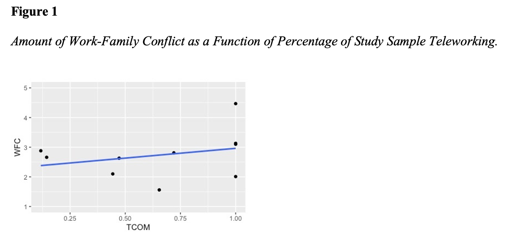
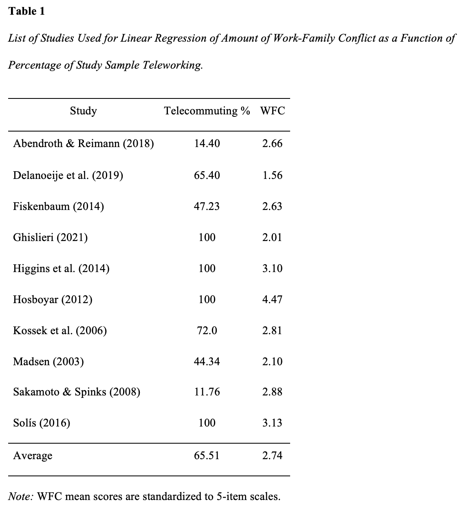
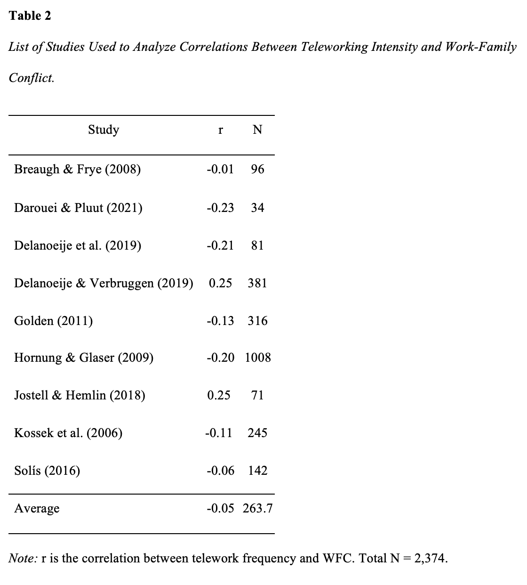

```{r setup, include=FALSE}
knitr::opts_chunk$set(echo = FALSE)

# Learn more about creating blogs with Distill at:
# https://rstudio.github.io/distill/blog.html

```


Teleworking from home has become an increasingly prevalent work arrangement with technology-integrated workplaces and the COVID-19 pandemic (Allen et al., 2021). In fact, a recent report by McKinsey (2020) predicted that post-pandemic, the amount of individuals teleworking could remain at three to four times higher than before the pandemic. Thus, understanding the potential positive and negative telework has important research and practice implications.  

Telework is defined as a work arrangement allowing employees to execute work tasks from home during some portion of the working week using information and communication technologies (ICTs; Delanoeije et al., 2019). Because it allows for work to be completed from home rather than a more distant workplace, telework is thought to have the potential to reduce conflict between the work and home domains due to increasing employee flexibility in how competing interdomain responsibilities are managed (Madsen, 2003). Conflicts between these domains are commonly referred to as work-family conflict (WFC) in the literature (Wilson & Baumann, 2015). WFC occurs “when role pressures from work and family are mutually incompatible such that participation in one role is made more difficult by virtue of participation in the other role” (Greenhaus & Allen, 2011 pp. 165-166). WFC infers a directional relationship such that work demands are actively conflicting with demands in the family realm.

Despite the purported potential to alleviate conflict between family and work domains, research findings on the effectiveness of telework have been inconsistent and inconclusive (Solís, 2016). Specifically, although some studies have found a reduction in WFC among those who telework (e.g., Hornung & Glaser, 2009; Delanoeije et al., 2019), other research has concluded that teleworkers may experience more interrole conflict by opting to work more hours while teleworking than they otherwise would have in a traditional work setting (e.g., Delanoeije & Verbruggen, 2019; Jostell & Hemlin, 2018).

This inconsistency suggests further exploration is necessary to understand the benefits and consequences of organizations implementing telework. To better understand the true nature of the relationship between telework and WFC, we conducted a qualitative and quantitative review of the research on 17 studies spanning over the past two decades. 

## Background

Polling data suggests that, in 2015, 37% of workers in the United States had teleworked at least once, up 28% from a similar poll conducted in 1995 (Gallup, 2015). Further, in the latest census completed in December of 2020, when asked the question, “Did any adults in this household substitute some or all of their typical in-person work for telework because of the coronavirus pandemic, including yourself?”, 36.9% of surveyed individuals answered “yes” (Census Bureau, 2021). As a result of the global pandemic, many workers have been forced to adopt telework as a means of remaining safe while completing their job responsibilities (Belzunegui-Eraso & Erro-Garcés, 2020). This increasing prevalence of telework has introduced a new variety of work-family dynamics to many employees who were previously used to having less permeable boundaries between the two domains, making it more important than ever to understand how telework and WFC interact.
	
While it appears that most theorizing suggests that telework should reduce WFC, opposing theoretical arguments about the relationship can be made. For example, it is possible that employees are now more well-equipped to reap the work-family related benefits of teleworking. The advancement of technology and increased access to ICTs (e.g., faster internet speeds, improved video conferencing platforms, smartphone technology, group-wide text messaging, etc.) could provide teleworkers with more resources to complete their work responsibilities. However, an argument can also be made that because of these advancements, people are more likely to be reached for work-related issues when they are at home, resulting in increased WFC. An additional tension exists surrounding the flexibility offered by telework. The increased flexibility of telework can allow employees to be at home and address family responsibilities as needed, which may lead to reduced WFC. Conversely, the diminution of work-family boundaries that comes with this flexibility may result in work demands actively conflicting with demands in the family realm. Thus, there are varying explanations on how telework could theoretically impact WFC. It is also important to note that, although telework has been traditionally theorized to reduce WFC, the empirical relationship between the two constructs is much less clear. Considering this, we decided to examine the current literature on the topic using both quantitative and qualitative methods. 

## Method

Four keyword searches were conducted using the EBSCOhost “Academic Search Complete” database and Google Scholar for relevant studies. Search keywords included “telecommuting”, “telework”, “work-from-home”, and “work-family conflict”. The EBSCOhost database was utilized as the primary search engine, yielding 18 studies, with the earliest of the studies being published in 2003. To find additional studies, a search was done on Google Scholar using the same search string. Available studies found on the first three pages of Google Scholar were examined and 3 additional studies were added.

To be considered for our review, studies needed to meet two forms of eligibility criteria. The meeting of these criteria was assessed by the two authors of this review. The first criteria was if the study reported the number of teleworking employees in their sample or a value of telework frequency. Studies that failed to note the percentage of teleworkers in their sample or a telework frequency value were removed from consideration. Notably, there were four studies in which every member of the sample was a teleworker. In these instances, we coded the percentage of teleworkers from these studies as 100%. Among the studies kept for analysis, the range of teleworker percentages among the samples ranged from 11.76% to 100%. 

The second criteria for inclusion was a reported value of WFC. Studies that assessed work and/or family role overload but did not assess specifically WFC were discarded to ensure construct consistency. Four studies did not meet our criteria and were excluded from our review, resulting in a final sample of 17 studies. 

We began with a qualitative coding of the studies. Studies were coded along three criteria: conceptualization and measurement of telework, theoretical framework of the study, and study design. During the initial quantitative coding phase, articles were placed into two separate divisions based on their conceptualization of telework. Specifically, articles were separated based on whether they reported the total percentage of teleworkers within a sample or reported the frequency of telework within a sample. In the former condition the reported levels of WFC in each sample were compared to the reported percentage of teleworkers within that sample, while in the latter condition, the correlation, r, between telework frequency and WFC was recorded. This allowed for a multifaceted view of the relationship between telework and WFC.  The most common reports of WFC utilized a 5-point scale (with higher values representing more conflict). Thus, we elected to standardize all reported values of WFC to fit a 5-point scale. This process included documenting the reported means of standard deviations of WFC given in each study and adapting the score to fit a 5-point scale.

Among the articles that provided a percentage of teleworkers within their sample, the percentage of teleworkers and an adjusted 5-point measure of WFC were recorded in the coding document. Within the subset of articles that reported telework frequency and WFC, the correlation between telework frequency and WFC were recorded in the coding document. After all the relevant data from the articles were coded, analyses were conducted. 

## Quantitative Analyses and Discussion

We ran linear regressions to test if the percentage of study participants teleworking would predict WFC. Next, we plotted the relationships between the percentage of study teleworking and WFC outcomes. Table 1 shows percentages and means of study variables. A simple linear regression was run to test percent teleworking outcomes on WFC. Percent teleworking did not significantly predict WFC, b = .659, p = .41. Figure 1 illustrates the lack of any meaningful trend in our studies between teleworking and WFC.  



Further, correlations between teleworking intensity and WFC were gathered from relevant studies in addition to sample sizes (N). Table 2 shows correlations of telework and WFC. Telework was not significantly related to WFC (r = -.046, 95% CI = [-.16, .08]). The total heterogeneity was 85.75%. Therefore, 85.75% of variation in the model reflected actual differences in the population mean. The confidence interval test revealed the 95% confidence interval for this value to be 65.97, 96.35. Our test for heterogeneity revealed that the included studies had significant between-study variance, Q = 68.97, p < .001. 



Quantitative analyses showed a lack of a significant relationship between telework and WFC. Further, this lack of relationship was found for the linear regression between percentage of study teleworking and mean levels of WFC as well as correlations between teleworking intensity and WFC. These findings suggest that this relationship may not be as simple as is commonly theorized and should be further examined.



## Qualitative Review

During the analysis portion of our research, several noteworthy trends among the articles were discovered. We decided that it would be valuable to highlight our views on how certain aspects of these trends in the telework and WFC literature could be limiting the potential of this research area. It is our belief that addressing the limitations we have highlighted in this section will ultimately lead to research with clearer takeaways than what has been previously produced in the literature.

## Limitation 1: Methodology

In our analysis of the 17 studies examining the relationship between telework and work-family conflict, we found that 13 of the studies (or 76.5%) relied on cross-sectional survey data, which might raise concerns with our ability to draw causal conclusions from this area of research (Spector, 2019).  Additionally, telework research has long relied on between-individuals methodology that compares the outcomes of teleworkers to traditional office workers (Allen et al., 2015). Scholars have noted that this reliance on between-individuals design in telework research may be flawed, as telework is oftentimes used interchangeably by workers throughout the week along with more traditional “in the office” work arrangements (Biron & Van Veldhoven, 2016). It is likely that more teleworkers are now “full time” teleworkers as a result of the shifting workplace landscape incurred by COVID-19, which would increase the utility of between-individuals research where full time teleworkers are compared to full time in-office workers, but there still remains a need for more diverse methodology in this research area that considers how telework effects workers taking a “hybrid” approach to working in-office and working from home (i.e., spending some work days in the office and other work days at home). 

## Suggestion 1

In our view, the methodological tendencies in the telework and work-family conflict literature have led to problems in accurately reflecting the use of telework in practice. This issue could be remedied by utilizing within-individual research methods like daily diary studies and longitudinal methods.  Daily diary methods, like those used in Daroeui and Pluut (2021), can allow researchers to obtain a deeper understanding of how the effect of telework on WFC varies across days. For example, since employees often opt to telework on certain days and work at the office on other days, an employee could use a diary throughout the week and their self-reported WFC on teleworking days and traditional “in office” workdays could be analyzed in conjunction with a qualitative analysis of their diary recording of those days. This methodology could be made even stronger by having family members of the employee also fill out diaries that note their perception of the employee’s WFC levels on teleworking days and traditional workdays. Employing within-person methods like a daily diary could more accurately capture the essence of telework as it is used in reality (i.e., in a “hybrid” way) while also providing greater detail and depth than typical cross-sectional methods.

## Limitation 2: Conceptualization of telework

Another concern that was raised during our analysis is the differing conceptualizations of telework used throughout the literature. Specifically, we found that, across studies, telework may be conceptualized in terms of the option to telework, the amount of time one teleworks, or whether someone uses telework. For example, several of the studies measured telework as a continuous variable where metrics such as “extent of teleworking”, “telework intensity”, or “telework volume” were used to assess the correlation between telework on WFC (e.g., Golden, 2011; Hornung & Glaser, 2009; Kossek et al., 2006). On the other hand, many studies opted to view telework as a categorical variable in which study participants were either coded as a teleworker or non-teleworker (e.g., Breaugh & Frye, 2008; Delanoeije & Verbruggen, 2019; Fiskenbaum, 2014). In some of the categorical studies, participants reported whether they made use of telework in the past as a means for determining whether they qualified as a teleworker (e.g., Breaugh & Frye, 2008; Delanoeije & Verbruggen, 2019). Other methods for establishing which participants could be classified as teleworkers included using commute time - where having no commute time meant that a participant was a teleworker (Sakamoto & Spinks, 2008), asking participants if they worked from home - where answering “yes” would establish a respondent as a teleworker (Abendroth & Reimann, 2018), or just relying on the organization to identify a sample of their teleworking employees (Hosboyar, 2012; Madsen, 2003). These different and inconsistent conceptualizations of telework make it challenging to compare findings across studies. 

## Suggestion 2
	
In examining these different conceptualizations of telework across several studies, we can see that there are potentially meaningful differences between the conceptualizations. Specifically, it is likely important that we make sure to distinguish between the constructs of “telework” and “telework intensity” in the future. These two constructs differ in the way that they are measured and, as a result, share different properties. It is possible that it is more appropriate to use a measure like “telework intensity” when examining how much telework an employee should use to reduce work-family conflict. For example, it would be interesting to investigate whether some people experience a curvilinear relationship between telework and work-family conflict, where at a certain point telework use starts to hinder an individual’s ability to properly manage conflict between the work and family domains. 
	
The continuous conceptualizations of telework (e.g., telework intensity, telework volume), should be clearly distinguished from the categorical conceptualizations of telework. When telework is observed as a categorical variable, it is often viewed as a way to compare teleworkers to non-teleworkers. Oftentimes, telework is conceptualized in this way when a study is examining a population of workers that only telework (e.g., no “in office” workdays). This sample of workers is likely to have different work-family balance strategies than workers who occasionally or inconsistently utilize telework (i.e., experience some form of teleworking intensity) since they are constantly teleworking and navigating their work schedule from home. Thus, it is possible that combining findings from studies that conceptualize telework in these two differing ways is misguided. Future meta-analytical examinations and reviews of the research on telework and work-family conflict should not conflate the continuous and categorical forms of telework. Additionally, future publications in this domain should specify from the onset which form of telework was tested. 

## Limitation 3: Lack of a unified theoretical framework

The last trend that we would like to highlight is the lack of a unified theoretical framework within the telework and WFC literature. Over the course of our review, several different theories were used to explain hypotheses regarding the relationship between telework and WFC. Namely, boundary theory (Delanoejie et al., 2019; Jostell & Hemlin, 2018; Kossek et al., 2006), job demands-resource model (Abendroth & Reimann, 2018), conservation of resources theory (Fiskenbaum, 2014; Ghislieri et al., 2021; Golden, 2011), and expectancy (VIE) theory (Hosboyar, 2012) were all used in the articles we reviewed. Additionally, several articles did not include an underlying theoretical framework (Breaugh & Frye, 2008; Delanoeije & Verbruggen, 2019; Hornung & Glaser, 2009; Sakamoto & Spinks, 2008; Sherman, 2020; Solís, 2016). While we recognize that each of these theories are suitable for research in the telework and work-family conflict domain, it may prove valuable to compress the amount of theoretical explanations put forth in this area of research.

## Suggestion 3

Unifying behind one theoretical framework in this area of research may help produce greater consistency in the development of methodology and interpretation of findings. For example, if research in this domain drew primarily from the conservation of resources theory (COR), then telework could be examined in terms of its propensity to incur resource gain or resource loss across multiple studies. The COR framework is integral to analyzing the effects of telework on employee outcomes like WFC because teleworking may provide employees with a means for acquiring, or potentially losing, resources that they otherwise would not have in a traditional workplace setting. For example, it is possible that an employee with higher  teleworking intensity will experience more resource gain than an employee with lower teleworking intensity, because increased teleworking intensity will allow for employees to work from home more, making dealing with family-related conflict events more manageable. However, it is also possibly the case that an employee with higher teleworking intensity may be exposed to more resource loss through family-related events during the workday (e.g., tending to the needs of a child), resulting in higher WFC. By using a unified theoretical framework across different studies in this research area, such as COR, results across studies would be more appropriate for comparison. 

## Conclusion

In this review we provided a quantitative and qualitative examination into the literature on telework and WFC. Based on our examination we believe that the telework and work-family relationship is one that remains unclear, perhaps due to the limitations in prior research that were discussed. Telework is a work modality that is likely to maintain an influential role in organizational functioning and employee wellbeing for the foreseeable future. As organizational scholars and practitioners, it is critical that we use the best methods available in our investigative repertoire to discover the effects of telework on critical job-related outcomes. 


## References

- (References marked with an asterisk indicate studies included in quantitative analysis)

Abendroth, A. K., & Reimann, M. (2018). Telework and work–family conflict across workplaces: investigating the implications of work–family-supportive and high-demand workplace cultures. In The work-family interface: Spillover, complications, and challenges. Emerald Publishing Limited. *

Allen, T. D., Golden, T. D., & Shockley, K. M. (2015). How effective is telecommuting? Assessing the status of our scientific findings. Psychological Science in the Public Interest, 16(2), 40-68.

Allen, T. D., Merlo, K., Lawrence, R. C., Slutsky, J., & Gray, C. E. (2021). Boundary Management and Work‐Nonwork Balance While Working from Home. Applied Psychology: An International Review, 70(1), 60–84.

Belzunegui-Eraso, A., & Erro-Garcés, A. (2020). Teleworking in the Context of the Covid-19 Crisis. Sustainability, 12(9), 3662.

Biron, M., & van Veldhoven, M. (2016). When control becomes a liability rather than an asset: Comparing home and office days among part‐ time teleworkers. Journal of Organizational Behavior, 37, 1317– 1337.

Breaugh, J. A., & Frye, N. K. (2008). Work–family conflict: The importance of family-friendly employment practices and family-supportive supervisors. Journal of business and psychology, 22(4), 345-353. *

Census Bureau. (2021). Those Who Switched to Telework Have Higher Income, Education and Better Health. Retrieved 11 October 2021, from https://www.census.gov/library/stories/2021/03/working-from-home-during-the-pandemic.html

Darouei, M., & Pluut, H. (2021). Work from home today for a better tomorrow! How working from home influences work‐family conflict and employees' start of the next workday. Stress and Health. *

Delanoeije, J., & Verbruggen, M. (2019). The use of work-home practices and work-home conflict: Examining the role of volition and perceived pressure in a multi-method study. Frontiers in psychology, 10, 2362. *

Delanoeije, J., Verbruggen, M., & Germeys, L. (2019). Boundary role transitions: A day-to-day approach to explain the effects of home-based telework on work-to-home conflict and home-to-work conflict. Human Relations, 72(12), 1843-1868. *

Fiksenbaum, L. M. (2014). Supportive work–family environments: implications for work–family conflict and well-being. The International Journal of Human Resource Management, 25(5), 653-672. *

Gallup (2015). In U.S., Telecommuting for Work Climbs to 37% available at: www.gallup.com/poll/184649/telecommuting-work-climbs.aspx.

Ghislieri, C., Molino, M., Dolce, V., Sanseverino, D., & Presutti, M. (2021). Work-family conflict during the Covid-19 pandemic: teleworking of administrative and technical staff in healthcare. An Italian study. La Medicina del lavoro, 112(3), 229. *

Golden, T. D. (2011). Altering the effects of work and family conflict on exhaustion: Telework during traditional and nontraditional work hours. Journal of Business and Psychology, 27(3), 255-269. *

Grandey, A. A., & Cropanzano, R. (1999). The conservation of resources model applied to work–family conflict and strain. Journal of Vocational Behavior, 54(2), 350-370.

Greenhaus, J. H., & Allen, T. D. (2011). Work–family balance: A review and extension of the literature. In J. C. Quick & L. E. Tetrick (Eds.), Handbook of occupational health psychology, 165–183.

Higgins, C., Duxbury, L., & Julien, M. (2014). The relationship between work arrangements and work-family conflict. Work, 48(1), 69-81. *

Hornung, S., & Glaser, J. (2009). Home-based telecommuting and quality of life: Further evidence on an employee-oriented human resource practice. Psychological Reports, 104(2), 395-402. *

Hosboyar, M. (2012). A quasi-experimental study on flexible work arrangements and job satisfaction: The moderational and mediational roles of work social support, work-family conflict and work-life balance. Alliant International University. *

Jostell, D., & Hemlin, S. (2018). After hours teleworking and boundary management: Effects on work-family conflict. Work, 60(3), 475-483. *
Kossek, E.E., Lautsch, B.A. and Eaton, S.C. (2006), “Telecommuting, control, and boundary management: correlates of policy use and practice, job control, and work-family effectiveness”. Journal of Vocational Behavior, 68(2), 347-367. *

Madsen, S. (2003). The Effects of Home-Based Teleworking on Work and Family Conflict (Ph.D.). University of Minnesota. *

McKinsey. (2020). What’s next for remote work: An analysis of 2,000 tasks, 800 jobs, and nine countries. Retrieved from https://www.mckinsey.com/featured-insights/future-of-work/whats-next-for-remote-work-an-analysis-of-2000-tasks-800-jobs-and-nine-countries

Sakamoto, Y., & Spinks, W. A. (2008). The impact of home-based telework on work-family conflict in the childcare stage. Journal of eWorking, 2(2). *

Sherman, E. L. (2020). Discretionary remote working helps mothers without harming non-mothers: Evidence from a field experiment. Management Science, 66(3), 1351-1374. *

Solís, M. S. (2016). Telework: conditions that have a positive and negative impact on the work-family conflict. Academia Revista Latinoamericana de Administración, 29(4), 435-449. *

Spector, P. E. (2019). Do not cross me: Optimizing the use of cross-sectional designs. Journal of Business and Psychology, 34(2), 125-137.

Wilson, K. S., & Baumann, H. M. (2015). Capturing a more complete view of employees’ lives outside of work: The introduction and development of new interrole conflict constructs. Personnel Psychology, 68(2), 235-282.
