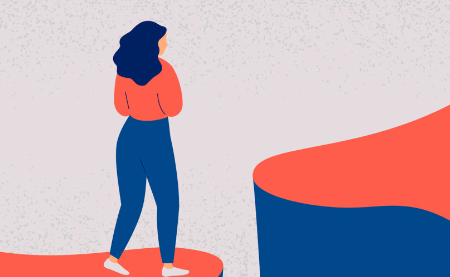
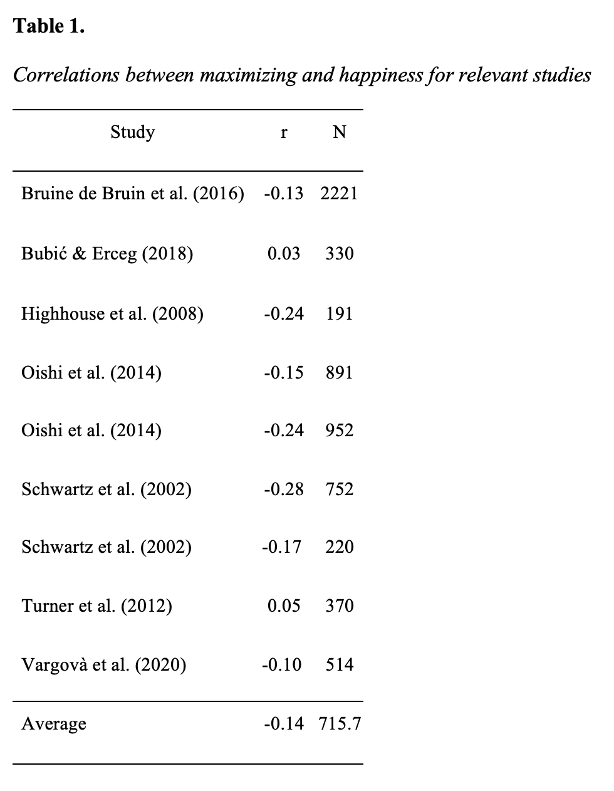
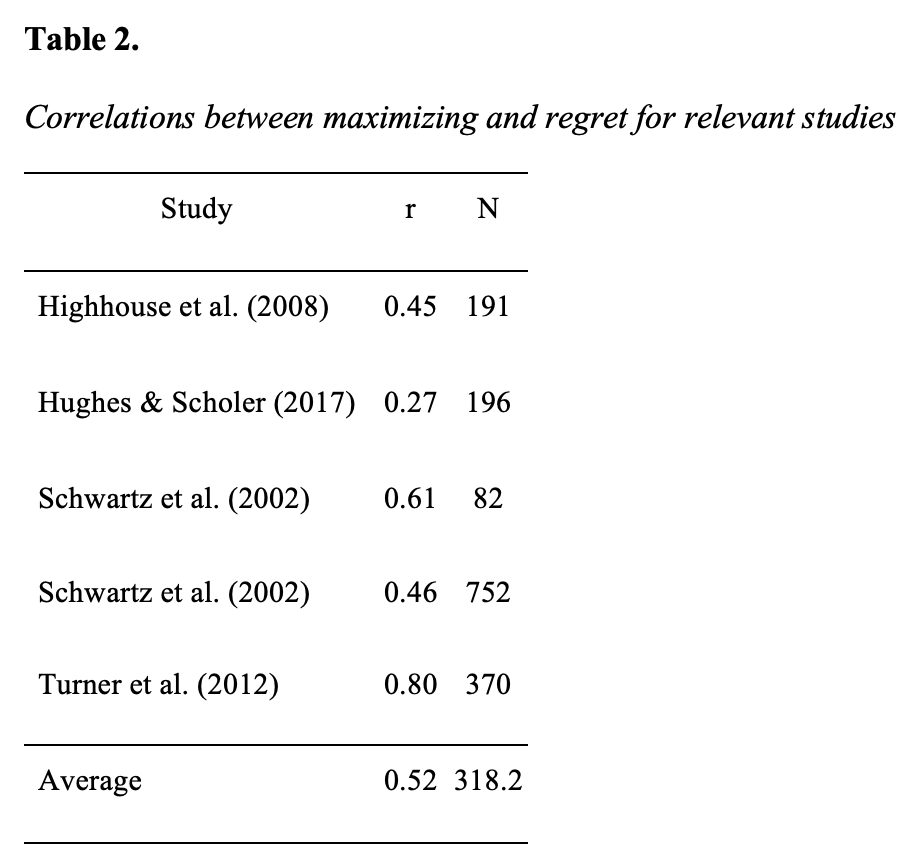
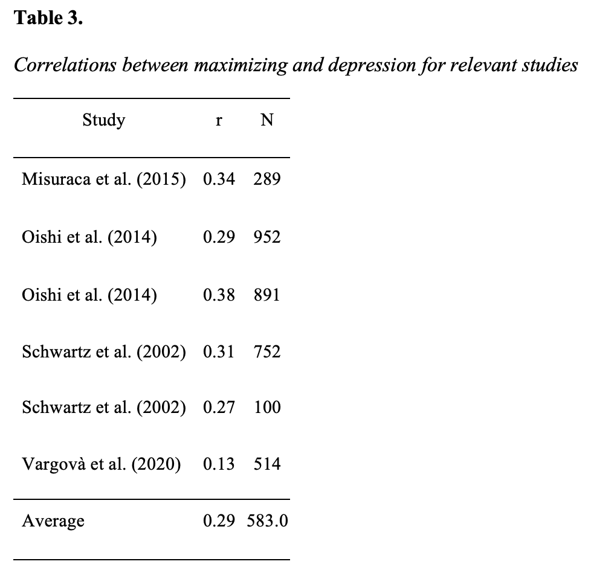

```{r setup, include=FALSE}
knitr::opts_chunk$set(echo = FALSE)

# Learn more about creating blogs with Distill at:
# https://rstudio.github.io/distill/blog.html

```



The choice of if and where to attend college is one of larger decisions an individual may make in their life. College choice is based on a variety of factors ranging from location and size to future job prospects and prestige of the programs. A key assumption in economics is that individuals are mostly rational and utilize all the available information when making their choices (Simon, 1979). Under this assumption, rational individuals will always choose the option that maximizes their satisfaction. However, behavioral economists have found that there is a limit to effective maximizing behavior (Roets et al., 2012), especially when faced with a choice such as college with endless factors to consider. 

Maximizers are people who strive to obtain the very best results out of every decision (Hughes & Scholer, 2017). In terms of a college decision, maximizers would be compelled to examine every option in order to maximize the utility of their choice. Strength of the program would be weighed against distance from home which would be considered in relation to the annual tuition. They rely heavily on external sources when evaluating their options and base their decision on metrics such as reputation, social status, and other measurable cues (Zhu et al., 2017). Satisficers are individuals who are happy to settle with a good option, not necessarily the best option of all (Roets et al., 2012). Satisficers are likely to choose a college that meets their needs and satisfies what they are looking to get out of a 4-year degree. With so many options to choose from in the modern world both approaches have their positives and negatives. 

Recent research has found that while maximizing choices and weighing all options is likely to result in a better overall decision, it can have adverse effects on an individual’s well-being (Schwartz et al., 2002). Recent college graduates who identify as maximizers accepted jobs with 20% higher starting salaries than their satisficing peers (Roets et al., 2012). Although their starting salaries may be higher, maximizers are more likely to be unhappy with their decision because they immediately begin to consider if they could have made a better choice (Hughes & Scholer, 2017. These ruminating behaviors are detrimental to maximizers’ well-being and beg the question whether the better decision is worth it. The current study aims to review and synthesize the data on maximizing and satisficing behaviors to analyze which decision-making method leads to the best outcomes in a variety of areas. A quantitative analysis is conducted to assess maximizing behavior on happiness, regret, and depression. 

## Cognitive Processes of Maximizing vs. Satisficing

Researchers have spent considerable time and resources attempting to define the exact parameters of maximizing and satisficing. The two types of decision-making are separated by the cognitive processes that the individual uses to make their decision (Hughes & Scholer, 2017). Past research has focused on three general factors to distinguish between the two cognitive approaches: pursuit of the best option, extensive evaluation of options, and experiencing the process of making decisions as difficult (Hughes & Scholer, 2017). 
	
The tenet of pursuit of the best option or “high standards” as it is often referred to focuses on the motivation of the individual to obtain the very best option from their decision (Schwartz et al., 2010). Maximizers will exhaust all their resources to arrive at the best option presented to them. Returning to our college search, let’s assume that our rational decision-maker has been accepted to four schools of comparable ranking. Following the rationale of pursuit of the best option, a maximizer will focus solely on differentiating the best school from the list of four. Satisficers do not behave in accordance with the pursuit of the best option and instead desire a result that is good enough to meet some of their criterion (Schwartz et al., 2002). Out of the four colleges that our decision-maker was accepted to, it is likely that one or more fulfills multiple aspects of criteria that are good enough. A satisficing approach in choosing one of the colleges will allow more options to be considered out of the list, although the best option may not be the one chosen in the end. Maximizing vs. satisficing can be differentiated by pursuit of the best option versus a simple desire for criteria that are good enough. 

The second principle that can be used to categorize maximizing vs. satisficing behavior is extensive evaluation of options. Maximizers are highly motivated to analyze all the details that are going into the overall decision, regardless of the stress that it creates (Hughes & Scholer, 2016).  A maximizer will likely conduct something like a multi-attribute utility analysis when choosing between the four colleges they were accepted to (Schwartz et al., 2010). Think of this as creating a big spreadsheet, listing all the things that matter about a college experience, and then attaching a weight to each attribute. Obviously, an extensive evaluation of the options can be time consuming and draining. Maximizers are likely to sacrifice their well-being to extensively review all aspects of the decision (Schwartz et al., 2002). Once again, satisficers act much differently than maximizers and do not need to extensively evaluate all the options. Satisficers simply encounter options and evaluate the options until one is encountered that exceeds an acceptability threshold (Schwartz et al., 2002). Once this option is presented to a satisficer, they are likely to end their evaluation without analyzing all other existing options because they have found an option that is satisfactory. Maximizing vs. satisficing can be categorized here as an extensive evaluation of options versus a simple acceptability threshold.

The third principle that is useful to navigate the differences between maximizers vs. satisficers is experiencing the process of making decisions as difficult. This decision difficulty is pronounced in maximizers. Maximizers suffer from wanting to maximize outcomes when there is too much choice (Roets et al., 2012). When a decision is multi-faceted, this can have negative effects for maximizers (Hughes & Scholer, 2017). Wanting to maximize the outcome of a decision is a very difficult process. Returning to our college search, it may be extremely difficult for a maximizer to land on one school and stick with that decision. Each time an option is chosen then the possibility that the incorrect decision has been made presents itself. The scores that the maximizer attaches to each college attribute are only predictions. It may be troubling to know that you are only guessing that the quality of social life at College A is better than College B. This back-and-forth results in a fairly difficult process for maximizers. Satisficers are less likely to find decisions as difficult (Schwartz, 2016). By only requiring a certain threshold of acceptability to be met, there are less factors to consider when arriving at an outcome. These three principles can help us categorize maximizing vs. satisficing behaviors as well as predict outcomes. 

## Psychological Outcomes of Maximizing vs. Satisficing

So, if we can draw these stark contrasts between maximizing and satisficing cognitive processes and behavior, is there an approach that is most beneficial to the decision-maker? We want to go to a good college, but we also don’t want to lose too much sleep over the choice. The literature analyzing differences between maximizing vs. satisficing is extensive. Past studies have shown that satisficing leads to greater relationship commitment (Lancaster, 2016), maximizing results in greater future-orientation and greater monetary investments (Zhu et al., 2017), and maximizers and satisficers have different concepts of time when making decisions (Misuraca & Teuscher, 2013). However, three concepts emerge as the most studied outcomes of maximizing vs. satisficing. Above all else, researchers have analyzed happiness, regret, and depression as outcomes of these decision-making styles. 

Happiness has been the most researched outcome of these two decision-making styles. Theoretically, maximizers should score lower in happiness compared to satisficers. Maximizers will likely obtain a better outcome than satisficers (Schwartz et al., 2010); however, this better outcome comes at the cost of time-consuming decision-making and feeling stressed for a greater portion of the process (Hughes & Scholer, 2017). Going through this stressful process may reduce an individual’s quality of life and therefore reduce their happiness (Schiffrin & Nelson, 2010). 
	
Regret is a key feature in finding decisions to be difficult for maximizers (Hughes & Scholer, 2017). In pursuit of the best outcome, any maximizer decision could always be considered as a possible regret because another option may have been superior. Satisficers would be less likely to experience regret with their decision as they simply require passing a threshold of acceptability (Roets et al., 2012). Maximizers are more likely to ruminate on their decision, resulting in feelings of regret that they may not have pursued the best option. 
	
This could all culminate in greater feelings of depression. Depression has been shown to be linked with perfectionism (Enns & Cox, 1999; Hewitt et al., 1990). Much like maximizing, perfectionism is the belief that an individual must always perfect every action they do. Pursuing the best option in every situation is exhausting and is bound to result in disappointment over time (Hughes & Scholer, 2017). Holding oneself and one’s decisions to unrealistic standards may result in a poor self-image and mental harm. Maximizing behavior is a strong theoretical predictor of increased depression. 

## Present Study
	
To uncover the true nature of the current relationship between maximizing behavior and the psychological outcomes of happiness, regret, and depression, a quantitative review of the research was conducted. To this end, meta-analytic procedures were employed on 9 articles encompassing 20 studies, spanning over the past two decades. 

## Method

Four keyword searches were conducted using Google Scholar for relevant studies with no specified timeframe. Keywords in the search included “maximizing vs. satisficing”, “maximizing vs. satisficing happiness”, “maximizing vs. satisficing regret”, and “maximizing vs. satisficing depression”. The original search yielded 12 studies, with the earliest of the studies being published in 2002. 

To be considered for the quantitative analysis, studies collected from Google Scholar needed to meet two forms of eligibility criteria. The first criterion assessed was if the study used empirical data to assess a relationship between maximizing and one of the outcome variables. It was decided to use measurements with maximizing since that seemed to be the dominant concept over satisficing. Three studies failed to measure outcomes in relation to maximizing and were eliminated from the study. The second criterion for inclusion was a reported correlation between maximizing and one of the three outcome variables. All remaining nine studies met this criterion for inclusion. 

Correlations between maximizing and happiness, regret, and depression were gathered from the nine studies in addition to sample sizes (N). As is evident in Tables 1, 2, and 3, some articles contained multiple studies and resulting in multiple studies being analyzed from a single article.
The package ‘robumeta’ in R was used to analyze the correlations between study variables. The first step was to transform Pearson’s r to z-scores. The quantitative analysis was conducted for happiness, regret, and depression separately. Random-effects models based on 9 studies for happiness, 5 studies for regret, and 6 studies for depression were calculated. Meta-analytic correlations and associated 95% confidence intervals were computed for each variable. A confidence interval that excludes zero indicates a statistically significant relationship.

Next, we transformed the z-scores back to Pearson’s r to report the tau-squared and heterogeneity of our models. We examined the variability of effect sizes based on the Q statistic. A statistically significant Q indicates there is heterogeneity in the study effect sizes that is attributable to true population differences. 

## Results

Table 1 shows correlations of maximizing and happiness. Maximizing was significantly related to happiness (r = -.14, 95% CI = [-.21, -.06]). The total heterogeneity was 87.94%. Therefore, 87.94% of variation in the model reflected actual differences in the population mean. The confidence interval test revealed the 95% confidence interval for this value to be 71.88, 96.93. Our test for heterogeneity revealed that the included studies had significant between-study variance, Q = 51.84, p < .001. Notably, there were two studies that found positive relationships between maximizing and happiness and would be considered outliers compared to the other seven studies. 



Table 2 shows correlations of maximizing and regret. Maximizing was significantly related to regret (r = .61, 95% CI = [.34, .89]). The total heterogeneity was 96.26%. The confidence interval test revealed the 95% confidence interval for this value to be 89.41, 99.54. Our test for heterogeneity revealed that the included studies had significant between-study variance, Q = 122.13, p < .001. 



Finally, Table 3 shows correlations of maximizing and depression. Maximizing was significantly related to depression (r = .30, 95% CI = [.22, .38]). The total heterogeneity was 80.07%. The confidence interval test revealed the 95% confidence interval for this value was 45.43, 96.41. Our test for heterogeneity revealed that the included studies had significant between-study variance, Q = 24.49, p < .001. 



## Discussion
	
The present study found that maximizing behavior was a significant predictor of decreased happiness, increased regret, and increased depression in the current literature. The majority of studies displayed the same strong trends for each psychological outcome, demonstrating that maximizing is a detrimental decision-making strategy across a range of study populations. We believe that our study contributes to the literature by offering an up-to-date synthesis of the current research in this domain. 

Perhaps when presented with the option to choose between four comparable colleges, an individual should understand that making the perfect decision is unrealistic. Once an option passes a threshold of acceptability (e.g., tuition is below national average), the psychological costs of constantly comparing that option to others may not be worth the marginal return. Maximizing vs. satisficing should be approached with the knowledge that while satisficing may result in only a satisfactory outcome, the decision-maker is less likely to be unhappy, regretful, and depressed following the decision. Maybe going with the “safety-school” isn’t the end of the world! 


## References

*Note*: References marked with an asterisk (*) were used in quantitative analysis.

Bruine de Bruin, W., Parker, A. M., & Strough, J. (2016). Choosing to be happy? Age differences in “maximizing” decision strategies and experienced emotional well-being. Psychology and aging, 31(3), 295. *

Bubić, A., & Erceg, N. (2018). The role of decision making styles in explaining happiness. Journal of Happiness Studies, 19(1), 213-229. *

Enns, M. W., & Cox, B. J. (1999). Perfectionism and depression symptom severity in major depressive disorder. Behaviour research and therapy, 37(8), 783-794.

Hewitt, P. L., & Flett, G. L. (1990). Perfectionism and depression: A multidimensional analysis. Journal of social behavior and personality, 5(5), 423.

Highhouse, S. E., Diab, D. L., & Gillespie, M. A. (2008). Are maximizers really unhappy? The measurement of maximizing tendency. Judgment and Decision Making Journal, 3(5), 364. *

Hughes, J., & Scholer, A. A. (2017). When wanting the best goes right or wrong: Distinguishing between adaptive and maladaptive maximization. Personality and Social Psychology Bulletin, 43(4), 570-583. *

Lancaster, M. (2016). Intimate Partner Violence: Satisficing or Maximizing? Examining Indicators of Relationship Commitment.

Misuraca, R., & Teuscher, U. (2013). Time flies when you maximize—Maximizers and satisficers perceive time differently when making decisions. Acta psychologica, 143(2), 176-180. *

Oishi, S., Tsutsui, Y., Eggleston, C., & Galinha, I. C. (2014). Are maximizers unhappier than satisficers? A comparison between Japan and the USA. Journal of Research in Personality, 49, 14-20. *

Roets, A., Schwartz, B., & Guan, Y. (2012). The tyranny of choice: A cross-cultural investigation of maximizing-satisficing effects on well-being. Judgment and Decision Making, 7(6), 689.

Schiffrin, H. H., & Nelson, S. K. (2010). Stressed and happy? Investigating the relationship between happiness and perceived stress. Journal of happiness studies, 11(1), 33-39.

Schwartz, B. (2016). On the meaning and measurement of maximization. Judgment and Decision making, 11(2), 126.

Schwartz, B., Ben-Haim, Y., & Dacso, C. (2010). What makes a good decision? Robust satisficing as a normative standard of rational decision making. Journal for the Theory of Social Behaviour, 41(2), 209-227.

Schwartz, B., Ward, A., Monterosso, J., Lyubomirsky, S., White, K., & Lehman, D. R. (2002). Maximizing versus satisficing: happiness is a matter of choice. Journal of personality and social psychology, 83(5), 1178. *

Simon, H. A. (1979). Rational decision making in business organizations. The American economic review, 69(4), 493-513.

Turner, B. M., Rim, H. B., Betz, N. E., & Nygren, T. E. (2012). The maximization inventory. Judgment and Decision Making, 7(1), 48-60. *

Vargová, L., Zibrínová, Ľ., & Baník, G. (2020). The way of making choices: Maximizing and satisficing and its relationship to well-being, personality, and self-rumination. Judgment & Decision Making, 15(5). *

Zhu, X. S., Dalal, D. K., & Hwang, T. (2017). Is Maximizing a Bad Thing?. Journal of Individual Differences.

